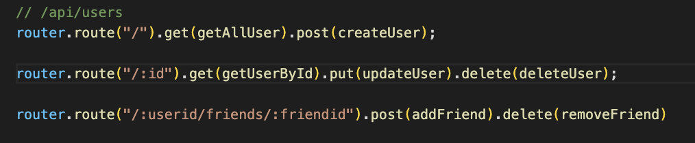
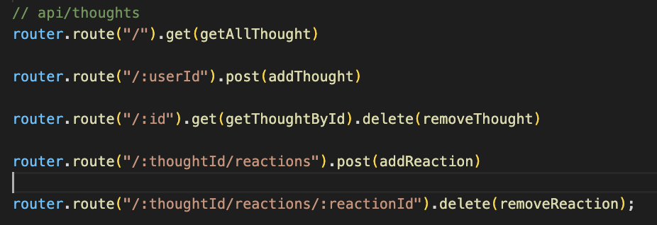

  
# Project Title - Social Network APIs
  
  
## Project Description
### This project uses MongoDB as a datastore, and mongoose as an ODM to demonstrate APIs.  
### GitHub Repository -  https://github.com/roo116/social-network-api
  
## Table of Contents
  - [Installation](#installation)
  - [Usage](#usage)
  - [License](#license)
  - [Contributing](#contributing)
  - [Tests](#tests)
  - [Questions](#questions)
  
## Installation

### This application requires [Insomnia](https://insomnia.rest/download), and [MongoDB](https://www.mongodb.com/) (community version works).  Google those packagesnif you don't know 
1. Clone or fork https://github.com/roo116/social-network-api
2. run `npm i` to install dependencies

### When application runs it should automatically build the database in MongoDB, if it's not already created.

Video of startup - https://drive.google.com/file/d/1kBc2mor6vyLDmZXd4BbNj-Yptb59UcGH/view?usp=sharing
 
## Usage
### Type `npm start` from the root directory of the application folder.  
### You can test these routes in Insomnia.  
User Routes  
  
Thought Routes  
   

### Route Demo Vides:  

Get Routes - https://drive.google.com/file/d/1q5xFAS7TIS4yhJKpatwRspn5myDfoqAC/view?usp=sharing

Add User - https://drive.google.com/file/d/1CoKioLuNjOF1hWiBKVn-Z5VQMYXf8iQz/view?usp=sharing  
Add Thought - https://drive.google.com/file/d/1bMHDVlLDipIbDxeFMvv7Dfq_Phm--i3k/view?usp=sharing  
Add Friend - https://drive.google.com/file/d/1J1AXtKv4ImXIA7exJJumBn5jJ-H5FReq/view?usp=sharing  
Add Reaction - https://drive.google.com/file/d/1osVB9NTnaeH_34DC3INCwqi5fuYK6XN3/view?usp=sharing  

Update User - https://drive.google.com/file/d/1c56_r7FvSqZNEqn4Cr15u__8G1qrqubm/view?usp=sharing  
Update Thought - https://drive.google.com/file/d/1NdY6Wjz-8rto_Y9pxGFXK5my9l1NEXQo/view?usp=sharing  

Delete User - https://drive.google.com/file/d/1c56_r7FvSqZNEqn4Cr15u__8G1qrqubm/view?usp=sharing  
Delete Thought - https://drive.google.com/file/d/1yQ20H4FLF0zHRvQ4L9kc-BJUvTgwvhqN/view?usp=sharing  
Remove Friend - https://drive.google.com/file/d/1vIlpKTJBAsOhICGbpWzlX9I3RD6w3AYp/view?usp=sharing  
Remove Reaction - https://drive.google.com/file/d/1xdknpUN1Kyb7iPlU1Rk5qmV1KJai24Yw/view?usp=sharing

## License
This is licensed under the MIT license. See the badge for the link to the license information.
  
## Contributing
contact using the contact methods below.

  
## Tests

These user stories were tested, and can be used to manually confirm the routes are working properly. 

WHEN I enter the command to invoke the application
THEN my server is started and the Mongoose models are synced to the MongoDB database
WHEN I open API GET routes in Insomnia for users and thoughts 
THEN the data for each of these routes is displayed in a formatted JSON 
WHEN I test API POST, PUT, and DELETE routes in Insomnia
THEN I am able to successfully create, update, and delete users and thoughts in my database
WHEN I test API POST and DELETE routes in Insomnia
THEN I am able to successfully create and delete reactions to thoughts and add and remove friends to a user’s friend list

  
## Questions
If you have questions, reach out via email or GitHub  
Gitub:  [GitHub Repository](https//github.com/roo116)  
Email:  hillkarl03@gmail.com  
  